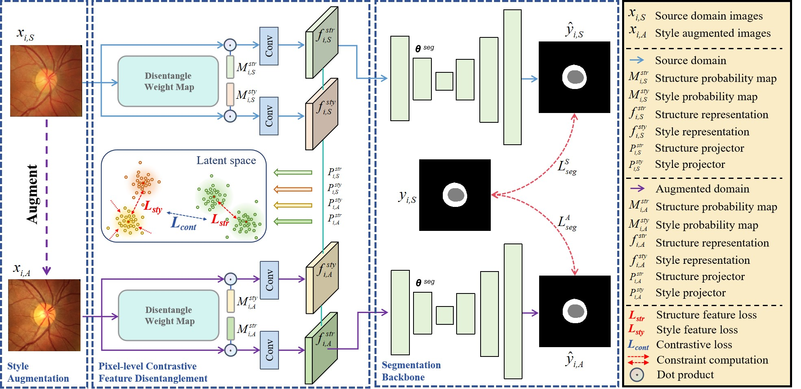

# PCSDG

This is the repository for the source code of the paper "***Structure-Aware Single-Source Generalization with Pixel-Level Disentanglement for Joint Optic Disc and Cup Segmentation***."

This article was published in *Biomedical Signal Processing and Control*, with DOI: [https://doi.org/10.1016/j.bspc.2024.106801](https://doi.org/10.1016/j.bspc.2024.106801). 

Keywords: **Single-source domain generalization**, **Joint optic cup and disc segmentation**.

## Data Preparation
We utilize the publicly available [RIGA+](https://zenodo.org/record/6325549) dataset for our experiments. 

* update\[2024.12.22\] -- Upload the preprocessed csv and python codes for REFUGE datasets. The preprocessed data in this article, you can download it directly via [Baidu Netdisk](https://pan.baidu.com/s/1400JPodPk_zkcBGCspgMfQ?pwd=9dpo) or [Google Drive](https://drive.google.com/file/d/1lIBJTbRy2v6l3zary3YkXp4ZOwDPcrWl/view?usp=sharing) (please cite this article and the REFUGE dataset literature).

```
Example:
"REFUGE dataset \cite{orlando2020refuge} comprises 1,200 fundus images
......
We used the REFUGE-train and REFUGE-val datasets as target domains and
employed the same preprocessing method as PCSDG \cite{jiangpcsdg2025}."

@article{jiangpcsdg2025,
title = {Structure-aware single-source generalization with pixel-level disentanglement for joint optic disc and cup segmentation},
journal = {Biomedical Signal Processing and Control},
volume = {99},
pages = {106801},
year = {2025},
author = {Jia-Xuan Jiang and Yuee Li and Zhong Wang}
}

@article{orlando2020refuge,
  title={Refuge challenge: A unified framework for evaluating automated methods for glaucoma assessment from fundus photographs},
  author={Orlando, Jos{\'e} Ignacio and Fu, Huazhu and Breda, Jo{\~a}o Barbosa and Van Keer, Karel and Bathula, Deepti R and Diaz-Pinto, Andr{\'e}s and Fang, Ruogu and Heng, Pheng-Ann and Kim, Jeyoung and Lee, JoonHo and others},
  journal={Medical image analysis},
  volume={59},
  pages={101570},
  year={2020},
  publisher={Elsevier}
}
```

## Model training and inference
To use this project, follow the steps below:
```python
# Train
python -m deeplearning.training.run_training

# Inference
python -m deeplearning.inference.run_inference
```

## :relaxed: Easy to Use！！！ 
* The code for "Structure-Aware Brightness Augmentation (SABA)" is mainly found in `src/datasets/utils/StructureAwareBrightnessAugmentation.py`. The code is as follows:
```python
import numpy as np
import random
from scipy.special import comb
from PIL import Image

class Structure_Aware_Brightness_Augmentation(object):
    def __init__(self,pixel_range=(0.,255.)):
        self.pixel_range = pixel_range
        self.nPoints = 4
        self.nTimes = 100000
        self.slide_limit = 20
        self._get_polynomial_array()

    def _get_polynomial_array(self):
        def bernstein_poly(i, n, t):
            return comb(n, i) * (t ** (n - i)) * (1 - t) ** i
        t = np.linspace(0.0, 1.0, self.nTimes)
        self.polynomial_array = np.array([bernstein_poly(i, self.nPoints - 1, t) for i in range(0, self.nPoints)]).astype(np.float32)

    def get_bezier_curve(self,points):
        xPoints = np.array([p[0] for p in points])
        yPoints = np.array([p[1] for p in points])
        xvals = np.dot(xPoints, self.polynomial_array)
        yvals = np.dot(yPoints, self.polynomial_array)
        return xvals, yvals

    def alpha_non_linear_transformation(self, image_brightness_inputs):
        target_min = 0.5 # 目标是把alpha映射到0.5~1.5
        start_point, end_point = image_brightness_inputs.min(), image_brightness_inputs.max()
        xPoints = [start_point, end_point]
        yPoints = [start_point, end_point]
        for _ in range(self.nPoints - 2):
            xPoints.insert(1, random.uniform(xPoints[0], xPoints[-1]))
            yPoints.insert(1, random.uniform(yPoints[0], yPoints[-1]))
        xvals, yvals = self.get_bezier_curve([[x, y] for x, y in zip(xPoints, yPoints)])
        xvals, yvals = np.sort(xvals), np.sort(yvals)
        return (np.interp(image_brightness_inputs, xvals, yvals) / 255) + target_min # 0~255线性映射到0.5~1.5，这个返回值就是alpha_brightness

    def brightness_transformation(self,inputs,alpha_brightness):
        beta_contrast = np.array(random.gauss(0, 0.1) * 255, dtype=np.float32)
        # beta_contrast = np.clip(beta_contrast, self.pixel_range[0] - np.percentile(inputs, self.slide_limit),
        #                    self.pixel_range[1] - np.percentile(inputs, 100 - self.slide_limit))
        return np.clip(np.abs(inputs * alpha_brightness + beta_contrast), self.pixel_range[0], self.pixel_range[1])

    def Local_Brightness_Augmentation(self, img_npy, mask):
        batch_size, channels, height, width = img_npy.shape
        image_brightness = np.zeros((batch_size, 1, height, width), dtype=img_npy.dtype)
        image_brightness[:, 0, :, :] = 0.299 * img_npy[:, 0, :, :] + 0.587 * img_npy[:, 1, :, :] + 0.114 * img_npy[:, 2, :, :]
        # img_transposed = img_npy.transpose(1, 2, 0)
        # img_restored = img_transposed.astype(np.uint8)
        # image_brightness= Image.fromarray(img_restored).convert("L")
        # image_brightness = np.array(image_brightness)
        # image_brightness = image_brightness[np.newaxis]

        output_image = np.zeros_like(img_npy)
        mask = mask.astype(np.int32)
        mask = np.tile(mask, np.array(img_npy.shape) // np.array(mask.shape))
        image_brightness = np.tile(image_brightness, np.array(img_npy.shape) // np.array(image_brightness.shape))

        for c in range(0,np.max(mask)+1):
            if (mask==c).sum()==0:continue
            output_image[mask == c] = self.brightness_transformation(img_npy[mask == c],
                                                                     self.alpha_non_linear_transformation(image_brightness[mask == c]))

        return output_image

```

* The code for "Pixel-Level Contrastive Single Domain Generalization" is mainly found in `src/models/unet_pcsdg_simple.py`. The code is as follows:
```python
class UNetPCSDG(nn.Module):
    def __init__(self, resnet='resnet34', num_classes=2, pretrained=False):
        super().__init__()
        cut, lr_cut = [8, 6]

        if resnet == 'resnet34':
            base_model = resnet34
        elif resnet == 'resnet18':
            base_model = resnet18
        elif resnet == 'resnet50':
            base_model = resnet50
        elif resnet == 'resnet101':
            base_model = resnet101
        elif resnet == 'resnet152':
            base_model = resnet152
        else:
            raise Exception('The Resnet Model only accept resnet18, resnet34, resnet50,'
                            'resnet101 and resnet152')

        self.DWM = DWM()
        layers = list(base_model(pretrained=pretrained).children())[:cut]
        first_layer = layers[0]
        other_layers = layers[1:]
        base_layers = nn.Sequential(*other_layers)
        self.first_layer = first_layer
        self.rn = base_layers

        self.num_classes = num_classes
        self.sfs = [SaveFeatures(base_layers[i]) for i in [1, 3, 4, 5]]
        self.up1 = UnetBlock(512, 256, 256)
        self.up2 = UnetBlock(256, 128, 256)
        self.up3 = UnetBlock(256, 64, 256)
        self.up4 = UnetBlock(256, 64, 256)

        self.up5 = nn.ConvTranspose2d(256, self.num_classes, 2, stride=2)

    def forward_DisentangleWeightMap(self, x, return_map=False):
        weight_map = self.DWM(x)
        weight_map_content, weight_map_style = weight_map[:, 0:1, :, :], weight_map[:, 1:2, :, :]
        image_content =  x * weight_map_content.expand_as(x)
        image_style = x * weight_map_style.expand_as(x)

        f_content = self.first_layer(image_content)  # 8 64 256 256
        f_style = self.first_layer(image_style)
        if return_map == True:
            return f_content, f_style, weight_map
        return f_content, f_style

    def forward(self, x):
        weight_map = self.DWM(x)
        weight_map_content, weight_map_style = weight_map[:, 0:1, :, :], weight_map[:, 1:2, :, :]
        image_content = x * weight_map_content.expand_as(x)
        image_style = x * weight_map_style.expand_as(x)

        f_content = self.first_layer(image_content)  # 8 64 256 256
        f_style = self.first_layer(image_style)

        x = F.relu(self.rn(f_content))
        x = self.up1(x, self.sfs[3].features)
        x = self.up2(x, self.sfs[2].features)
        x = self.up3(x, self.sfs[1].features)
        x = self.up4(x, self.sfs[0].features)
        output = self.up5(x)

        return output

    def close(self):
        for sf in self.sfs: sf.remove()
```


## Citation :heart_eyes: :fire:
If you find this repo useful for your research, please consider citing the paper as follows:
```
@article{jiangpcsdg2025,
title = {Structure-aware single-source generalization with pixel-level disentanglement for joint optic disc and cup segmentation},
journal = {Biomedical Signal Processing and Control},
volume = {99},
pages = {106801},
year = {2025},
author = {Jia-Xuan Jiang and Yuee Li and Zhong Wang}
}
```

## Acknowledgment :sparkles:
This code is based on implementations by CCSDG ([https://github.com/ShishuaiHu/CCSDG](https://github.com/ShishuaiHu/CCSDG))

